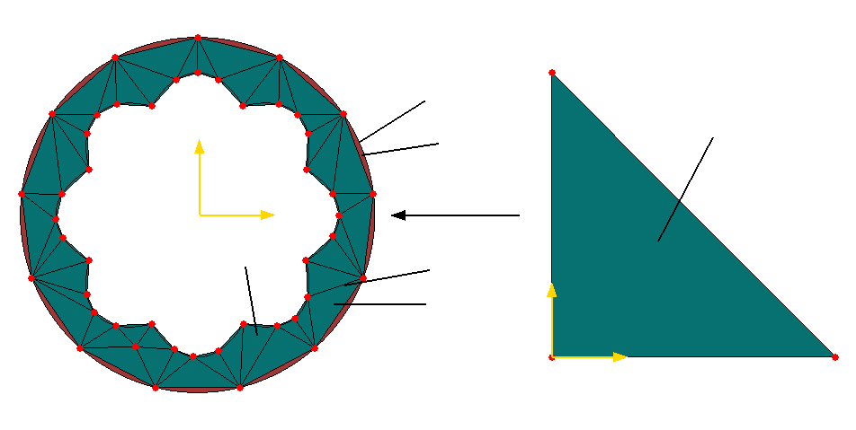

# Spatial Discretization via Least-Squares Finite Elements

**Dr.-Ing. Serdar Serdas**

## Notation

| Symbol | Meaning |
|--------|---------|
| $\mathcal{B}, \mathcal{B}_0$ | Physical domain (current, reference configuration) |
| $\mathcal{B}^h, \mathcal{B}_0^h$ | Discretized domain (union of all finite elements) |
| $\mathcal{B}_e, \mathcal{B}_0^e$ | Physical domain of element $e$ (current, reference) |
| $\hat{\mathcal{B}}_e$ | Reference (isoparametric) element of element $e$ |
| $\partial\mathcal{B}$ | Boundary of domain $\mathcal{B}$ |
| $n_{\mathrm{elem}}$ | Number of finite elements in the mesh |
| $N$ or $n_{\mathrm{en}}$ | Number of element nodes (local degrees of freedom) |
| $N_I, N^I$ | Shape (interpolation) function associated with node $I$ |
| $\boldsymbol{\xi}$ | Natural / isoparametric coordinates, e.g. $(\xi,\eta,\zeta)$ |
| $\boldsymbol{X}, \boldsymbol{x}$ | Material (reference) and spatial (current) coordinates |
| $\boldsymbol{X}_I, \boldsymbol{x}_I$ | Nodal coordinates in reference and current configuration |
| $\boldsymbol{J}_e$ | Jacobian of mapping $\hat{\mathcal{B}}_e \rightarrow \mathcal{B}_0^e$ |
| $\boldsymbol{j}_e$ | Jacobian of mapping $\hat{\mathcal{B}}_e \rightarrow \mathcal{B}_e$ |
| $\boldsymbol{F}$ | Deformation gradient $\boldsymbol{F} = \partial\boldsymbol{x}/\partial\boldsymbol{X}$ |
| $\nabla_{\boldsymbol{\xi}}$ | Gradient w.r.t. natural coordinates $\boldsymbol{\xi}$ |
| $\nabla_{\boldsymbol{X}}, \nabla_{\boldsymbol{x}}$ | Gradients w.r.t. material and spatial coordinates |
| $\mathrm{Grad}, \mathrm{grad}$ | Material and spatial gradients of vector fields |
| $f$ | Generic scalar integrand on an element |
| $w_{GP}$ | Gauss quadrature weight associated with Gauss point $GP$ |
| $n_{\mathrm{GP}}$ | Number of Gauss points per element |
| $L^p(\mathcal{B})$ | Lebesgue space of $p$-integrable functions on $\mathcal{B}$ |
| $W^{k,p}(\mathcal{B})$ | Sobolev space of order $k$ with integrability exponent $p$ |
| $H^k(\mathcal{B})$ | Sobolev (Hilbert) space $W^{k,2}(\mathcal{B})$ |
| $P_r, Q_r$ | Lagrange elements of degree $r$ (triangular / 1D, quadrilateral) |

Spatial discretization of partial differential equations in mechanics can be carried out using various numerical frameworks, most prominently the finite difference method, the finite volume method, and the finite element method (FEM). Each of these approaches is based on a different discretization philosophy and exhibits distinct advantages and limitations when applied to problems in continuum mechanics and related fields.

The finite difference method, historically the earliest of the three, relies on structured grids and on the systematic use of Taylor-series expansions to approximate spatial derivatives. This inherently local construction is straightforward on regular meshes but tends to become cumbersome and less flexible when the underlying geometry involves complex shapes, curved boundaries, or highly heterogeneous domains. As a consequence, its applicability to multi-dimensional engineering problems with intricate geometrical features is often restricted.

The finite volume method has gained substantial popularity, particularly in the numerical treatment of flow and transport problems. Its key characteristic is the formulation of discrete balance laws over control volumes that enforce local and global conservation of fluxes. This conservation property, together with its ability to handle discontinuities and sharp gradients, explains its widespread use in computational fluid dynamics and related areas where accurate flux representation is crucial.

In the present work, attention is focused on the finite element method and its application to the spatial discretization of governing field equations. Within this context, FEM is employed in a least-squares formulation, which confers several beneficial properties. Least-squares finite elements lead to symmetric and typically positive definite algebraic systems, enhance robustness with respect to stabilization and boundary-condition enforcement, and provide a natural framework for treating a broad spectrum of problem types. Consequently, FEM in least-squares form proves to be highly reliable for a wide range of applications, including those involving complex material behavior, multi-physics couplings, and higher-order differential operators.

A further strength of the finite element framework lies in its geometric flexibility. By allowing the use of unstructured meshes composed of arbitrary element shapes, FEM can efficiently represent complicated geometries and localized features such as re-entrant corners, thin layers, or localized inclusions. This capability is particularly important for realistic engineering simulations, which often demand accurate resolution of geometry-induced stress concentrations or flow features that cannot be captured adequately on simple regular grids.

Historically, the foundations of the finite element method in structural and solid mechanics were laid in the early 1960s, when seminal contributions by several research groups systematically developed the method and demonstrated its potential for structural analysis. Subsequent work generalized the original concepts, formalized the underlying variational framework, and extended the method to thermomechanics, fluid flow, electromagnetics, and other branches of applied physics. Over the decades, FEM has evolved into a central tool of model-based numerical simulation, with comprehensive historical treatments documenting its conceptual development, the emergence of key formulations and element types, and its integration into modern computational engineering practice.

## The finite element discretization

In contrast to the finite difference method, the finite element method offers several advantages, in particular with respect to geometric flexibility, accuracy, and the treatment of boundary conditions, which makes it the method of choice for many complex engineering applications. It can naturally accommodate irregular and curved geometries and boundaries, in contrast to FDM, which is best suited to regular, structured grids. This feature is essential for the analysis of realistic engineering components with intricate shapes. A further advantage is the possibility of employing higher-order approximations via polynomial shape functions of varying degree, which leads to increased accuracy at both local and global levels. In addition, FEM supports local mesh refinement, including adaptive mesh refinement (a priori LSFEM), which enables enhanced resolution of regions with sharp gradients or localized phenomena. Heterogeneous media, in which material properties vary within the domain, can be modeled straightforwardly by assigning different properties to individual elements. Owing to this generality and flexibility, FEM is widely used in structural analysis, electromagnetics, heat transfer, fluid dynamics, and multi-physics simulations.

In the following, the basic components of the finite element method are briefly summarized, namely the subdivision of the physical domain ${\cal B}$ into finite elements ${\cal B}^h$, the interpolation of the field variables (unknowns), and the numerical integration over the discretized domain.

**<u>Discretization of the domain</u>**

Figure~\ref{fig:Chap3_Discretization} illustrates a central step in the finite element method: the discretization of a geometrically complex two-dimensional domain. On the left, the “Physical space” representation shows the actual geometry of the problem, given by a domain ${\cal B}_0$ with both internal and external curved boundaries. This domain is partitioned into smaller, non-overlapping triangular elements ${\cal B}_e$, whose vertices define the mesh nodes. The discretized domain ${\cal B}^h_0$ is constructed as the union of all finite elements and constitutes an approximation of the original domain ${\cal B}_0$. The external boundaries $\partial{\cal B}_0$ and element boundaries $\partial{\cal B}_e$ are indicated, and the mapping from the reference element to a generic physical element is denoted by $\boldsymbol{J}_e$.

On the right, the “Isoparametric space” shows a reference triangle in the local coordinate system $(\xi,\eta)$, which serves as a standardized template for all elements in the physical domain. This reference element $\hat{\cal B}_e$ has a simple canonical shape and provides a convenient setting for defining shape functions and performing numerical integration. The mapping from isoparametric (reference) space to physical space is essential for an accurate representation of curved geometries and general element shapes, since it permits the consistent evaluation of integrals and interpolation functions over each element.

The discretization process is formalized by

$$\mathcal{B}_0 \approx \mathcal{B}_0^h = \bigcup_{e = 1}^{n_{\mathrm{elem}}} \mathcal{B}_0^e$$

which states that the original domain is approximated by the union of all element domains $\mathcal{B}_0^e$. Each element carries geometric information as well as the associated physical fields, and the resulting mesh provides a flexible framework for the numerical solution of partial differential equations on arbitrary domains. This combined use of physical and isoparametric spaces underpins the flexibility and accuracy of the finite element method for complex geometries.

Every finite element is associated with spatial and physical quantities, for instance kinematical variables. These quantities are approximated by means of shape functions. The spatial coordinates within an element can be expressed in the reference and in the current configuration as

$$\boldsymbol{X} \approx \boldsymbol{X}_h = \sum_{I=1}^{N} N_I \, \boldsymbol{X}_I, \qquad \boldsymbol{x} \approx \boldsymbol{x}_h = \sum_{I=1}^{N} N_I \, \boldsymbol{x}_I$$

where $N_I$ denotes the shape function associated with node $I$. In the same way, the physical fields of interest, such as velocity, displacement, electric potential, concentration, temperature, or pressure, are approximated within each element according to

$$\boldsymbol{V} \approx \boldsymbol{V}_h = \sum_{I=1}^{N} N_I \, \boldsymbol{V}_I, \qquad \boldsymbol{v} \approx \boldsymbol{v}_h = \sum_{I=1}^{N} N_I \, \boldsymbol{v}_I$$

**Figure 1**: Discretization $\mathcal{B}^h_0$ of $\mathcal{B}_0$ using triangular elements $\mathcal{B}_e$.  
**Left**: Physical space with $\boldsymbol{J}_e$ mapping.  
**Right**: Reference triangle $\hat{\mathcal{B}}_e$ in $(\xi,\eta)$.

